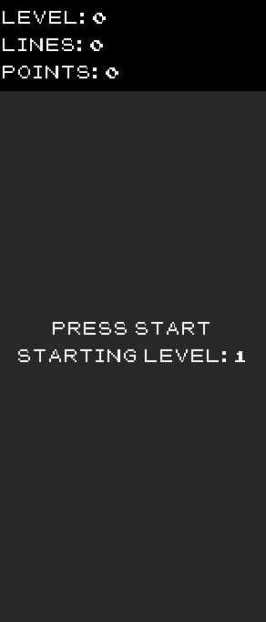
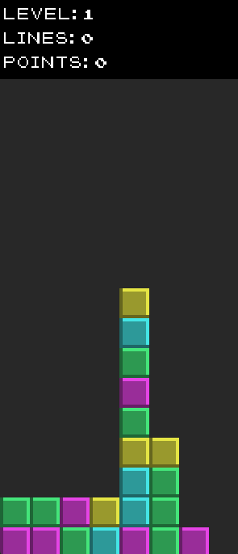
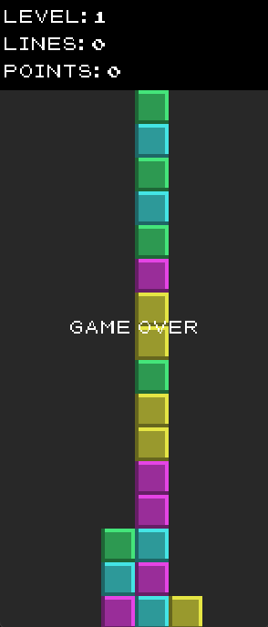

# Puyo Puyo Challenge

A Puyo Puyo game clone in C++ using the SDL2 library.

## 🎮 Instructions

1. **Compilation:**
   - There's no need to download SDL depencies. 
   - [SDL2](https://www.libsdl.org/) and [SDL_ttf](https://www.libsdl.org/projects/SDL_ttf/) libraries are available in the project root folder.
   - All dependencies are available in lib and include folders
   - Use a C++ compiler to compile the source code.
   - This project uses Makefile, to compile it just run in the terminal:
   <br>
   
   ```
   make
   ```

2. **Execution:**
   - Run main.exe in the root folder after compilation.
   - Use the arrow keys to move the pieces, the down arrow key to speed up the fall, and the space bar to rotate the piece.

## 🎉 Features

- Simple graphical interface using SDL2.
- Intuitive and familiar controls.
- Classic gameplay mechanics.
- The game is played on a 8x16 grid.
- The Objective of the game is to match same colored pieces.
- There should be 4 different colored pieces.
- Pieces always appear in pairs, each piece may randomly share or differ in color to the other piece in the pair.
- Pairs are spawned above the top of the grid, dropping down until they are placed.
- The pair is considered placed when any of the pieces of the pair cannot be moved further down.
- The game is lost if it is not possible to place the pair within the grid.
- The player controls the pair’s movement by:
    - Moving the pair sideways.
    - Rotating the pair in 90 degree angles (left or right).
    - Making the pair fall faster.
    - Once the pair is placed.
        - The player can no longer move the pair.
- The pieces will unpair and each of them will fall to the lowest position it can reach.
- Once there is no movement (all pieces placed), matches are validated and removed from the grid.
- The next pair will be spawned once all matches are cleared.

## 🔎 Incompleted features
I needed to make decisions to manage the time and deliver the challenge scope on deadline. These two topics need further work:

- Chain algorithm (Forming groups of 4+ pieces, in L, T, square or other fully connecting shapes destroys the pieces)
   - I have a hard time to reposition the pieces individually after doing the chain clean, and I was going out of time.
   - Workaround: Keep the line scoring like in Tetris. 
- Object-Oriented Design Patterns
   - After having a functional game, I started the code refinement, moving structs to class.
   - I was able to start polish the code and move Game struct to a class.
   - The full implementation of Object-Oriented Design Patterns are still TBD.

## 🕹️ How to Play

1. **Start the Game:**
   - Press the space bar to start the game.

2. **Controls:**
   - Use the arrow keys to move the pieces left, right, or down.
   - Press the up arrow key to rotate the piece.
   - Press the down arrow to speed up the piece's fall.
   - Press the space bar to drop the piece.

3. **Scoring:**
   - Earn points by completing lines.
   - The longer the chain, the more points you earn.
   - Advance through levels by earning points.

4. **Game Over:**
   - The game ends when the Blocks reach the top of the screen.

## 🚀 Development

- Developed in C/C++.
- SDL2 library for graphical manipulation.

## 🖼️ Screenshots

  <kbd>
    
    <br>
    Starting Level
  </kbd>
  
  <kbd>
    
    <br>
    Gameplay
  </kbd>

  <kbd>
    
    <br>
    Game Over
  </kbd>

---

Enjoy! 🕹️
